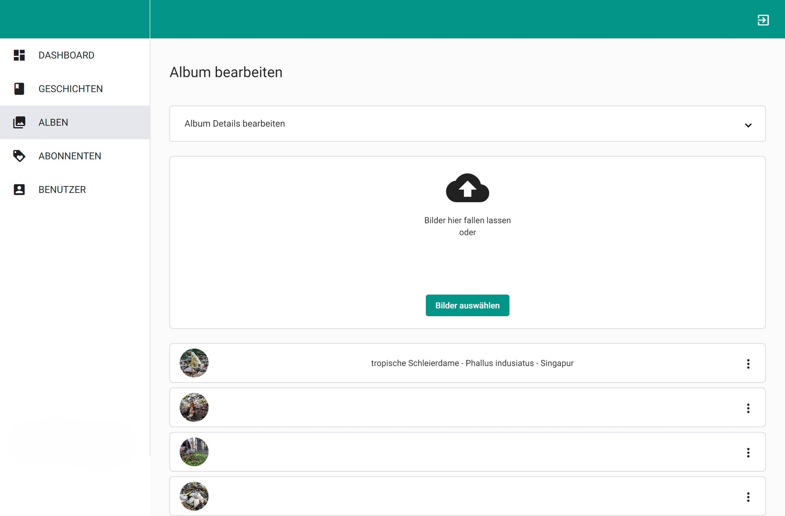

# blackbeetle.de admin frontend

## blackbeetle.de

Blackbeetle is a small private website project that I started before my trip to Australia. In order to keep my family and friends up to date without sending everyone the same messages over and over again, I set up this little travel blog. The project has changed a lot over time. Whenever I try out a new technology, Blackbeetle is my test object. Initially, the entire page was implemented with Laravel framework. I later separated the API and created two frontends, one for the public and one for the administration.

Other parts of this Project are the [Public Frontend](https://github.com/j-brand/blackbeetle-frontend) and the [Backend API](https://github.com/j-brand/blackbeetle-backend)

## The admin frontend

The admin frontend can be used to enter new data and manage existing data. New picture albums can be created here, new blog entries made, emails sent and users managed. In order to find an entry into new technologies (RxJs and Typescript), I have implemented the admin frontend in Angular.

Contents that can be created are photo galleries, stories and story posts.
It is possible to choose between four different types of story posts:

- image post (upload images)
- text post (write a text insie a WYSISYG editor)
- video post (upload a video)
- map post (place markers on a google map and write a description)

## Technologies & Frameworks

- [Angular](https://angular.dev/) 14
- [Angular Material Design Components](https://material.angular.io/) 14.0.4
- [Tailwind CSS](https://tailwindcss.com/) 3.1.4

## Screenshots

#### Admin Dashboard

#### Image post Upload

#### Map Post

